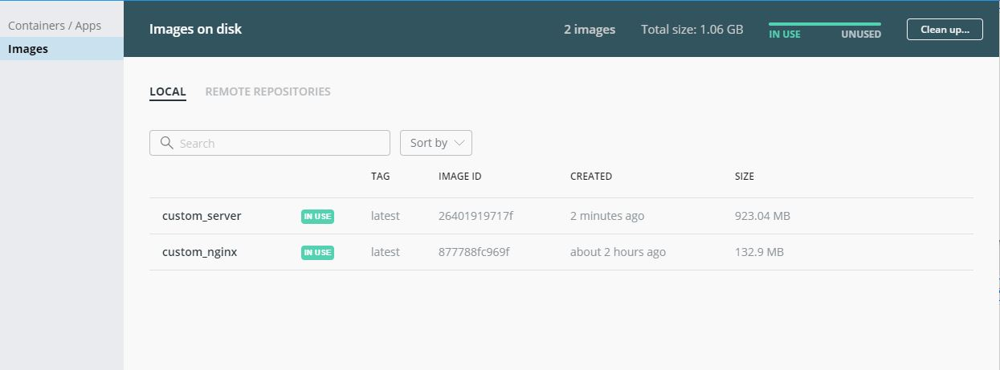
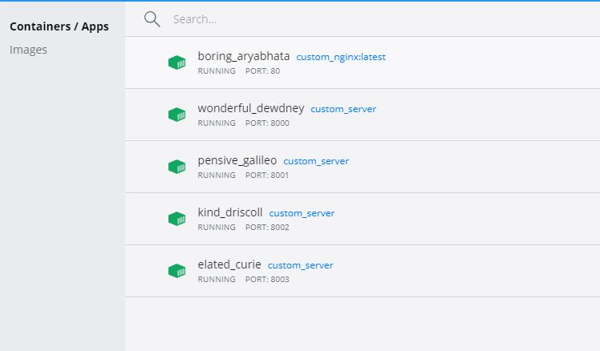
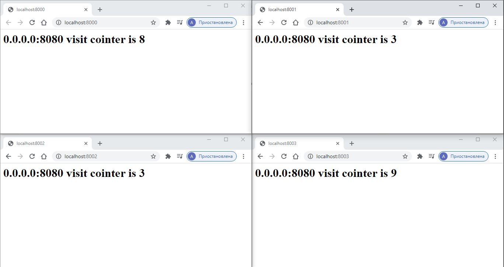

# Lab_01 QT Server | Nginx | Docker

Вся работа выполнялась на ОС Windows x64

Папка server содержит:
 - package.json зависимости, необходимые для запуска сервера
 - Dockerfile для сборки сервера
 - server.js описание сервера
 
Папка nginx содержит:
 - Dockerfile для сборки Nginx с измененным конфигурационным файлом
 - Конфигурационный файл Nginx

## Запуск

* Скачать код из репозитория.
* Запустить nginx в Docker

    cd nginx
    docker build -t "custom_nginx" .
    docker run -d --rm -p 80:80 custom_nginx 
    
* Запустить сервер в 5-ти экземплярах
    
    
    cd server 
    docker build -t custom_server .
    docker run -d -p 8000:8080 custom_server 
    docker run -d -p 8001:8080 custom_server
    docker run -d -p 8002:8080 custom_server
    docker run -d -p 8003:8080 custom_server
    docker run -d -p 8004:8080 custom_server
    
## Проверка

Перейти в браузере по адресам localhost:800_. 
Обновляя страницу можно увидеть как Nginx перенапрвляет запросы к одному из 5 запущенных серверов.

Созданные image

Запущенные containers

Пример работы

