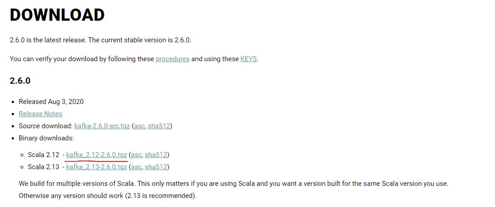
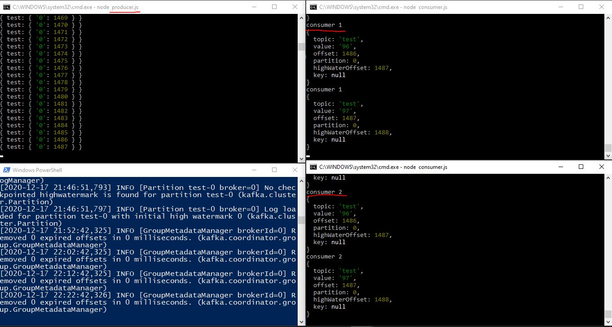

# Lab_03 Kafka | NodeJS

Вся работа выполнялась на ОС **Windows 10**

## Инструкция запуска сервера Kafka

Инструкция была взята с этого сайта: https://dzone.com/articles/running-apache-kafka-on-windows-os

**Русская** версия инструкции: https://coderlessons.com/articles/bazy-dannykh-articles/nastroika-i-zapusk-apache-kafka-v-os-windows

Для установки сервера Kafka нужно скачать бинарный файл.

## Сервер *consumer* и *producer*

**producer.js** создает сообщения с задержкой в 500мс и отправляет в очередь

Документация по Producer: https://github.com/SOHU-Co/kafka-node#producer

---

**consumer.js** считывает сообщения из очереди

Документация по Consumer: https://github.com/SOHU-Co/kafka-node#consumer

---

Документация по библиотеке **kafka-node**: https://github.com/SOHU-Co/kafka-node

## Проверка

Запустите сервер Kafka

Создайте топик **test** из под пути `путь_до_кафки\bin\windows.` командой:

    kafka-topics.bat --create --zookeeper localhost:2181 --replication-factor 1 --partitions 1 --topic test

После того, как создан топик выполните следующие команды:

    git clone https://github.com/AcoaAera/Laby_work
    cd Lab_3\
    ### В разных терминалах запускаем команды
    
    # Запуск отправителя
    node producer.js
    
    # Запуск получателя 1
    node consumer.js
    
    # Запуск получателя 2
    node consumer.js
    
В результате отправитель будет отправлять в топик **test** сообщения, а получатели считывать их и выводить в консоль:

