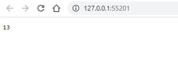

# Lab_08 Kubernetes | Minikube

Создал репозиторий на **docker hub** с названием **counter-nodejs

Создаем **image** своего сервера

    docker build -t acoaaera/counter-nodejs .

Авторизуемся в **docker hub**

    docker login
    
Пушим в репозиторий наш **image**

    docker push acoaaera/counter-nodejs

Запускаем **minikube**

    minikube start

Создаем Deployment в Kubernetes, используя свой образ **acoaaera/counter-nodejs** с Docker Hub

    kubectl create deployment  hello-node --image=acoaaera/counter-nodejs

Получаем доступ к объекту Deployment

    kubectl expose deployment hello-node --type=LoadBalancer --port=8080

Запускаем созданный сервис

    minikube service hello-node

В результате будет запушен наш сервер 

После окончания работы почистим за собой все

    kubectl delete deployment --all    
    kubectl delete service --all    
    kubectl delete pod --all

Останавливает **minikube**

    minikube stop

Удаляем **minikube**

    minikube delete